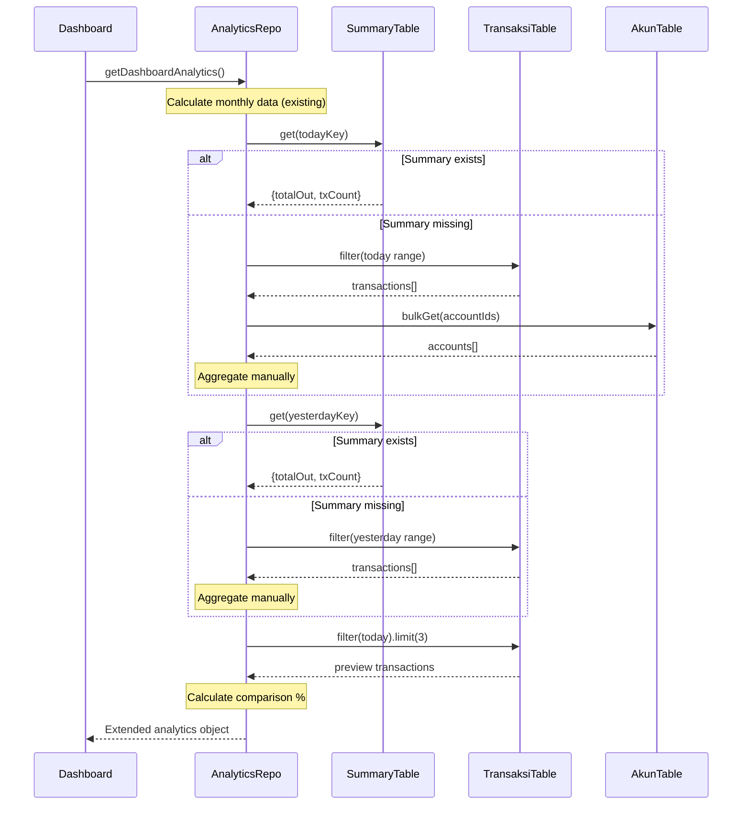

I have created the following plan after thorough exploration and analysis of the codebase. Follow the below plan verbatim. Trust the files and references. Do not re-verify what's written in the plan. Explore only when absolutely necessary. First implement all the proposed file changes and then I'll review all the changes together at the end.

## Key Observations

The codebase uses IndexedDB via Dexie with a well-structured repository pattern. The `summaryHeatmapDay` table is automatically maintained through transaction lifecycle hooks, providing O(1) daily expense lookups. The existing `getDashboardAnalytics()` function focuses on monthly aggregations, and `getTransactionTemplates()` currently returns all templates without pagination. The Money utility handles integer-based currency storage (cents) with conversion helpers. The `fetchTransactionsWithAccounts()` helper pattern enriches transactions with account details efficiently.

## Approach

Extend the repository layer with backward-compatible additions to support today-first dashboard analytics. Use the existing `summaryHeatmapDay` table for O(1) today/yesterday lookups with fallback to transaction aggregation when summary data is missing. Add an optional `limit` parameter to template queries using Dexie's native `.limit()` for performance. Implement percentage comparison logic with proper edge case handling (division by zero). Follow existing patterns for date handling, account enrichment, and error handling to maintain consistency.

## Implementation Steps

### 1. Extend `getDashboardAnalytics()` in `file:src/lib/db/analytics-repo.ts`

Add helper functions for date range calculation at the top of the file (after existing helper functions around line 120):

- Create `getTodayDateRange()` - returns `{ start, end }` with today's date at 00:00:00 and 23:59:59
- Create `getYesterdayDateRange()` - returns `{ start, end }` for yesterday using same logic
- Create `calculatePercentageChange(current: number, previous: number): number | null` - returns percentage change or `null` when previous is 0

Add helper function `getDailySummary(dateKey: string, dateRange: { start: Date, end: Date })`:

- Import `toDayKey` from `file:src/lib/db/summary.ts`
- Query `db.summaryHeatmapDay.get(dateKey)` for O(1) lookup
- If summary exists, return `{ income: 0, expense: totalOut, net: -totalOut, transactionCount: txCount }`
- If summary missing, fallback to `fetchTransactionsWithAccounts(dateRange.start, dateRange.end)`
- Aggregate transactions: sum income (where `kreditAkun.tipe === "INCOME"`), sum expense (where `debitAkun.tipe === "EXPENSE"`)
- Return `{ income, expense, net: income - expense, transactionCount }`

Modify `getDashboardAnalytics()` function (starting at line 462):

- Keep all existing monthly calculation logic unchanged
- After line 551 (before return statement), add today/yesterday data fetching
- Call `getTodayDateRange()` and `getYesterdayDateRange()`
- Generate date keys using `toDayKey()` from summary.ts
- Fetch today's summary using `getDailySummary(todayKey, todayRange)`
- Fetch yesterday's summary using `getDailySummary(yesterdayKey, yesterdayRange)`
- Fetch today's transactions for preview: `fetchTransactionsWithAccounts(todayRange.start, todayRange.end)` then sort by `tanggal` descending and take first 3
- Calculate comparison metrics using `calculatePercentageChange()` for income, expense, and net
- Set `hasYesterdayData: true` if yesterday has any transactions, otherwise `false`
- Extend return object with new fields: `today`, `yesterday`, `comparison`

Return type structure:
```typescript
{
  // Existing fields (unchanged)
  totalSaldo: number
  pemasukanBulanIni: number
  pengeluaranBulanIni: number
  selisihBulanIni: number
  pengeluaranPerKategori: Array<{...}>
  trendBulanan: Array<{...}>
  
  // New fields
  today: {
    income: number
    expense: number
    net: number
    transactionCount: number
    transactions: Array<Transaction> // First 3, newest first
  }
  yesterday: {
    income: number
    expense: number
    net: number
  }
  comparison: {
    incomeChange: number | null
    expenseChange: number | null
    netChange: number | null
    hasYesterdayData: boolean
  }
}
```

### 2. Add `limit` Parameter to `getTransactionTemplates()` in `file:src/lib/db/transaction-templates-repo.ts`

Modify function signature (line 7):

- Add optional parameter: `options?: { limit?: number }`
- Extract limit with default: `const limit = options?.limit ?? 999`
- Chain `.limit(limit)` after `.reverse()` and before `.toArray()` (line 9)
- Keep existing error handling and return structure unchanged

Updated function:
```typescript
export async function getTransactionTemplates(options?: { limit?: number }) {
  try {
    const limit = options?.limit ?? 999
    const templates = await db.templateTransaksi
      .orderBy("usageCount")
      .reverse()
      .limit(limit)
      .toArray()
    return { success: true, data: templates }
  } catch (error) {
    // existing error handling
  }
}
```

### 3. Edge Case Handling

Percentage comparison logic:

- When `yesterday.expense === 0` and `today.expense > 0`: return `null` (not infinity)
- When both are 0: return `null`
- When `yesterday.expense > 0`: return `((today - yesterday) / yesterday) * 100`
- Round to 1 decimal place for display: `Math.round(percentage * 10) / 10`

Summary table fallback:

- Always check if `summaryHeatmapDay.get(dateKey)` returns data
- If `undefined` or `null`, fallback to transaction aggregation
- Log warning when fallback is used for debugging: `console.warn("Summary missing for", dateKey, "using fallback")`

New user scenario:

- When no transactions exist today: return `{ income: 0, expense: 0, net: 0, transactionCount: 0, transactions: [] }`
- When no transactions exist yesterday: return `{ income: 0, expense: 0, net: 0 }` with `hasYesterdayData: false`

### 4. Performance Optimizations

Use IndexedDB native operations:

- Leverage `summaryHeatmapDay` table for O(1) lookups (single `.get()` call per day)
- Use `.limit()` on Dexie collections (not array slicing) to reduce memory usage
- Batch account fetching in `fetchTransactionsWithAccounts()` (already implemented)

Minimize queries:

- Fetch today's transactions once, use for both aggregation and preview
- Reuse `fetchTransactionsWithAccounts()` helper for consistency
- No N+1 queries - single bulk fetch for accounts

### 5. Backward Compatibility

Ensure existing consumers continue to work:

- All existing return fields remain unchanged in structure and type
- `getTransactionTemplates()` without parameters returns all templates (default limit 999)
- No breaking changes to function signatures
- New fields are additive only

Testing considerations:

- Verify existing dashboard page (`file:src/app/page.tsx`) still renders correctly
- Ensure monthly analytics calculations remain accurate
- Confirm template sorting by `usageCount` descending is preserved

## Data Flow Diagram

