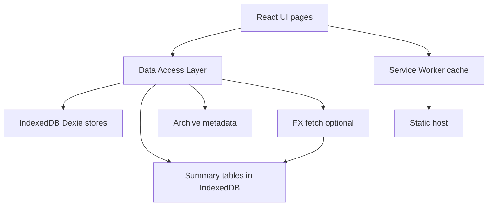

# Plan: Dompetku on Android (100% free) via Offline-First PWA

This plan assumes Dompetku is for **personal** use and must run on Android **without** Flutter / Android Studio. The chosen approach is an **offline-first installable PWA** with **local persistence** and **local analytics** to avoid any cloud read quotas.

## 0) Current baseline (what we are starting from)

- Dompetku is a Next.js App Router app (see [`package.json`](../package.json)).
- Data layer today is Prisma + SQLite (see [`prisma/schema.prisma`](../prisma/schema.prisma:1)).
- Mutations/read paths are implemented as Server Actions under [`src/app/actions/`](../src/app/actions/).

Implication: a typical free-tier serverless deployment will struggle with **writable SQLite** persistence, and even if moved to a free cloud DB, every daily usage becomes **metered reads/writes**.

## 1) Target architecture (approved)

### 1.1 High-level

- **Android UX**: Installable PWA (Chrome Add to Home Screen) + offline app shell.
- **Primary DB**: Dexie (IndexedDB).
- **Analytics**: local materialized summary tables + incremental updates.
- **Correctness**: background rebuild tool (Web Worker) + integrity check/repair.
- **Retention**: range archive + prune raw transactions; keep aggregates; archived periods are visible but **non-clickable**.
- **Hosting**: static hosting (GitHub Pages / Cloudflare Pages / Vercel static), no Node runtime.

### 1.2 Data flow diagram

Notes:
- UI never calls a remote API for core features.
- The only network access is optional FX refresh, and static asset download.

### 1.3 Decision summary (explicit)

- **Primary mode**: offline-first PWA (daily usage never requires cloud).
- **Local DB**: Dexie + IndexedDB (client-only) with summary tables.
- **Cloud**: optional only (backup/export/import + FX refresh).

## 2) Local database design (Dexie + IndexedDB)

### 2.1 Mapping from Prisma

We map entities from [`prisma/schema.prisma`](../prisma/schema.prisma:1) into IndexedDB stores.

Core stores (minimum):
- `akun`
- `transaksi`
- `rencana_cicilan`
- `recurring_transaction`
- `budget`
- `networth_snapshot`
- `settings`
- `log_sistem` (optional, may be local-only for diagnostics)

### 2.2 Indexes (critical for speed)

Because Android performance hinges on indexing, define compound indexes aligned with UI filters:

- `transaksi` indexes:
  - by date (descending) for timeline pages
  - by `kategori + date`
  - by `debitAkunId + date`
  - by `kreditAkunId + date`
  - optional normalized full-text-ish index for `deskripsi` search (prefix search only)

- `akun` indexes:
  - by `tipe`
  - by `nama` (unique constraint handled at app-level)

For pagination, prefer cursor-based queries using `(tanggal, id)` style ordering similar to Prisma indices (see indexes in [`prisma/schema.prisma`](../prisma/schema.prisma:116)).

## 3) Analytics materialized views (summary tables)

Goal: dashboards and analytics should be O(1) to O(log n), not scan 10k–100k transactions.

### 3.1 Summary stores

Recommended stores:

1) `summary_month`
- Key: `YYYY-MM`
- Columns: total_in, total_out, net, tx_count

2) `summary_category_month`
- Key: `YYYY-MM|kategori`
- Columns: total_out, tx_count

3) `summary_heatmap_day`
- Key: `YYYY-MM-DD`
- Columns: total_out, tx_count

4) `summary_account_month`
- Key: `YYYY-MM|akunId`
- Columns: delta, tx_count

5) `networth_snapshot`
- Key: `YYYY-MM-DD` (or month)
- Columns: total_aset, total_hutang, networth, breakdown_json

### 3.2 Incremental maintenance rules

For every mutation, update both raw store and summary stores:

- Create transaction:
  - insert into `transaksi`
  - update `akun.saldoSekarang` for debit/kredit
  - update `summary_month`, `summary_category_month`, `summary_heatmap_day`, `summary_account_month`

- Edit transaction:
  - compute diff between old and new (date/category/account/nominal)
  - apply inverse updates for old values, then apply updates for new values

- Delete transaction:
  - remove from `transaksi`
  - reverse balance impact
  - reverse summary contributions

- Transfer between accounts:
  - persist as a single `transaksi` with `debitAkunId` + `kreditAkunId` (kategori e.g. `TRANSFER`)
  - update both account balances (debit +, kredit -) as usual
  - apply summary deltas using account types:
    - if neither side is `INCOME`/`EXPENSE`, `summary_month`/`summary_category_month` stay unchanged
    - `summary_account_month` still updates both accounts for cashflow tracking

- Recurring run (auto-post):
  - generate one `transaksi` per due schedule (use `idempotencyKey` = recurringId + period)
  - update `recurring_transaction.terakhirDieksekusi`
  - apply standard create transaction summary deltas

- Cicilan payment:
  - insert `transaksi` with `rencanaCicilanId`
  - increment `rencana_cicilan.cicilanKe`, update `status` when fully paid
  - update account balances + summaries using standard create rules

Implementation detail: do all changes in a single Dexie transaction to guarantee consistency.

### 3.3 Correctness tooling

Provide:
- `Rebuild summaries` function (runs in Web Worker):
  - truncates summary stores
  - scans `transaksi` once
  - re-materializes all summaries
- `Integrity check`:
  - validate account balances vs recomputed ledger
  - validate summary totals vs recomputed totals for a sampled window
  - if mismatch: offer repair (rebuild)

## 4) Retention + archive + pruning (lifetime usability)

### 4.1 Objective

Allow you to keep the app fast for life while still preserving long-term insights.

### 4.2 Archive model

Add an `archive_period` store:
- Key: `YYYY-MM`
- Fields: `archived: true`, `archive_file_ref`, `createdAt`

### 4.3 Workflow (user-facing)

1) Select range (e.g., 2021-01 to 2022-12)
2) Export archive file containing:
   - raw transactions in range
   - optionally related entities if needed for interpretation
   - integrity metadata (hashes, counts)
3) After export success, perform pruning:
   - delete raw `transaksi` rows in range
   - keep `summary_*` rows for those months
   - mark months in `archive_period`
4) UI behavior (UX 1):
   - archived months display an Archived badge
   - drilldown entry points are disabled (no error state)

### 4.4 Bookkeeping integrity when pruning

If you remove old ledger rows, you must preserve correct balances:

- Option A (recommended): generate a **carry-forward opening balance** entry at the first day after the pruned range.
  - This is a synthetic transaction or a dedicated `opening_balance_adjustment` record.
  - Ensures `saldoSekarang` remains correct and future deltas reconcile.

The rule should be deterministic and auditable.

### 4.5 Full backup + archive import/export (offline)

Goal: allow safe offline backup/restore without any server.

**Full backup format** (single file, versioned):
- `meta`: version, createdAt, appVersion, schemaVersion
- `data`: export all core stores (`akun`, `transaksi`, `rencana_cicilan`, `recurring_transaction`, `budget`, `settings`, `networth_snapshot`, `log_sistem`, `summary_*`, `archive_period`, `notifications`)
- `stats`: counts per store for quick validation

**Encryption (recommended)**:
- Use Web Crypto `AES-GCM` with passphrase-derived key (`PBKDF2` + salt + iterations).
- Store `salt`, `iv`, `kdfParams` in file header.
- Allow **unencrypted** export for debugging (explicit toggle only).

**Large dataset handling**:
- Export in **chunks** to avoid memory spikes (e.g., 2k–10k rows per chunk).
- Use streaming where possible; otherwise build `Blob` incrementally.

**Restore flow**:
- Validate version + integrity counts.
- Option to **wipe existing** data or merge (merge only for advanced users).
- Use Dexie `bulkPut` per store within a transaction and rebuild summaries if needed.

**Archive import**:
- Allow rehydrate raw `transaksi` for an archived range from archive file.
- After import, re-run summaries for that range, then update `archive_period` flag accordingly.

## 5) Refactor strategy (from Server Actions to offline DAL)

### 5.1 Key decision

Server Actions in [`src/app/actions/`](../src/app/actions/) must be replaced by a client-side data layer.

Strategy:
- Extract pure domain logic (validation, computations) into shared modules.
- Implement a repository layer backed by Dexie.
- Update UI components/pages to call repositories instead of Server Actions.

### 5.2 Data access layer shape

Create module boundaries:
- `repositories/*`: CRUD and query primitives
- `usecases/*`: business flows (create transfer, post recurring, generate cicilan payment)
- `domain/*`: deterministic calculators and validators

This keeps future sync possible without rewiring the UI.

### 5.3 Migration steps (Server Actions -> offline DAL)

1) Extract shared logic into `domain/*` (validation, calculators).
2) Create repository interfaces in [`src/lib/repositories`](../src/lib/repositories) and implement with Dexie.
3) Map each action in [`src/app/actions/`](../src/app/actions/) to a client usecase in `usecases/*`.
4) Update UI components to call repositories/usecases (no Server Actions in client).
5) Remove server-only imports (Prisma) from client bundles.

Suggested action mapping checklist:
- `transaksi` -> repository in [`src/lib/db/transactions-repo.ts`](../src/lib/db/transactions-repo.ts)
- `akun` -> repository in [`src/lib/db/accounts-repo.ts`](../src/lib/db/accounts-repo.ts)
- `transfer` -> usecase wrapping repos in [`src/lib/db/transfer-repo.ts`](../src/lib/db/transfer-repo.ts)
- `cicilan` -> repository in [`src/lib/db/cicilan-repo.ts`](../src/lib/db/cicilan-repo.ts)
- `summary` -> helpers in [`src/lib/db/summary.ts`](../src/lib/db/summary.ts)

## 6) Static hosting + PWA

### 6.1 Static export constraints

To run on static hosting, we must avoid server runtime dependencies.

Planned changes:
- Configure static output in [`next.config.ts`](../next.config.ts:1)
- Remove/replace runtime server needs (Prisma, API routes that require Node)

### 6.2 PWA requirements

Add:
- Web manifest (name, icons, start_url, display standalone)
- Service worker caching strategy:
  - cache-first for static assets
  - network-first with fallback for HTML shell
  - versioned cache + safe update prompt

### 6.3 Static export checklist

- Set `output: "export"` in [`next.config.ts`](../next.config.ts:1).
- Remove dependency on Node-only APIs (Prisma, `fs`, Server Actions).
- Replace API routes under [`src/app/api/`](../src/app/api/) with client-side logic or remove.
- Ensure all routes are static-friendly (no runtime server props).

### 6.4 Service worker + manifest placement

- Web manifest: place in [`public/manifest.webmanifest`](../public/manifest.webmanifest) and link from [`src/app/layout.tsx`](../src/app/layout.tsx).
- Service worker: static file in [`public/sw.js`](../public/sw.js), register in a small client hook (e.g. `useEffect` in [`src/app/layout.tsx`](../src/app/layout.tsx)).
- Offline shell: cache `/` and key route shells at install time.

## 7) Optional FX rate updater (network only when available)

Design:
- Fetch rates manually or on app open with a throttle (e.g., once per day)
- Store last-known rates locally
- Always allow offline usage with last-known rate and clear UI state

### 7.1 FX store + update rules

- Persist in `currencyRate` store (already in Dexie schema).
- On app open or manual refresh, fetch if last update > 24h.
- Update by currency pair (`[kodeAsal+kodeTujuan]` index).

## 8) Performance validation strategy

Test targets:
- 10k, 50k, 100k transactions
- Cold start time
- Timeline scroll + pagination
- Search/filter
- Analytics pages (heatmap, YoY, drilldown)

If needed:
- Add additional indexes
- Add caching of expensive computed views
- Ensure analytics reads hit summary tables only

### 8.1 Test dataset generation

- Add a dev-only generator UI (seed 10k/50k/100k into IndexedDB).
- Provide a clear reset/wipe button for repeatable tests.

## 9) Deployment options (100% free tier)

Since the app is static:

- GitHub Pages: free hosting for static assets
- Cloudflare Pages: free static hosting + CDN
- Vercel: static hosting on free tier

No database hosting needed.

## 10) Deliverables checklist (what Code mode will implement)

- Local DB (Dexie) + schema + indexes
- Summary tables + incremental maintenance
- Rebuild/integrity worker
- Archive/export/import + pruning with carry-forward
- Replace Server Actions usage with offline DAL
- Static export configuration
- PWA manifest + service worker
- FX fetch + cache
- Documentation

## 11) Developer experience (dev/test workflow)

### 11.1 Will `npm run dev` still work?

Yes. The dev experience can remain essentially the same:

- Keep Next.js dev server via [`package.json`](../package.json:1) script `dev`.
- Run locally in the browser; the app will use IndexedDB on your machine for storage.

The main difference is that data is no longer in SQLite file `dev.db`. Instead, data lives in browser storage (IndexedDB). That is acceptable for offline-first.

### 11.2 Dev tooling we should add

To keep iteration speed high, add:

- **Dev seed/reset** UI or script: create dummy accounts/transactions in IndexedDB (similar intent to Prisma seed).
- **Export/Import** in dev: so you can snapshot your dataset and restore quickly.
- **DB inspector** (optional): a hidden debug page to inspect stores, last mutations, and summary state.

This replaces Prisma-centric workflows while preserving fast feedback loops.

### 11.3 Dev backup utilities

- Add buttons for **Export Full** and **Import** using the same offline backup format.
- Include a small JSON preview for validation (first 5 rows per store).

## 12) Future: receipt image -> LLM-assisted transaction input

Your future feature idea is compatible with this architecture if we design it as a **pluggable pipeline**:

1) Acquire image (camera/file upload)
2) Extract structured fields (merchant, date, totals, items)
3) Map to Dompetku transaction draft
4) User confirms / edits
5) Persist transaction locally + update summaries

### 12.1 Where does the image live?

Recommended default policy (privacy + storage safety):

- **In-memory only**: the image is handled as a `File`/`Blob` during processing and **not persisted** after the draft is created.
- If you need retry/debug, add an **explicit opt-in** toggle: store as an attachment.

If we do persist, choices (still offline-first):

- Store encrypted `Blob` in IndexedDB (attachment store) with retention rules.
- Or store only derived text + a low-res preview.

### 12.2 Can it be 100% offline?

There are 3 possible implementations, all compatible with the offline-first refactor:

- **Offline OCR first**: on-device OCR (e.g., Tesseract.js) to extract text locally, then your own parser/rules for Indonesian receipts.
- **Remote LLM (optional)**: send image/text to an API when online. This will not be “free 100% forever” unless you self-host or accept quotas, but the app can treat it as an optional enhancement.
- **Local LLM (optional)**: call a local endpoint you run yourself (e.g., on laptop/desktop in your LAN). Still no paid cloud required.

Architecturally, we implement an interface like `ReceiptExtractor.extract()` and keep the rest of Dompetku independent.

### 12.3 Data safety and cleanup

To avoid storage bloat:

- Default: delete image immediately after draft is confirmed.
- If stored: apply retention (e.g., auto-delete after N days) + manual cleanup.
- Keep only the extracted structured data needed for the ledger.

## 13) User docs (deliverable)

Document:
- Install on Android (Add to Home Screen)
- Offline behavior + what works without internet
- Backup/restore + archive export/import (including encryption option)
- Pruning policy + carry-forward rule
- Migration from current SQLite [`dev.db`](../dev.db)

Suggested doc locations:
- Update [`README.md`](../README.md) for install/offline basics.
- Add detailed guide in [`DOKUMENTASI_PROYEK.md`](../DOKUMENTASI_PROYEK.md).

